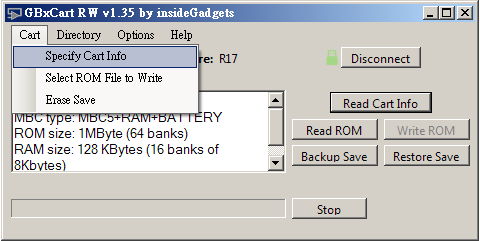

# GBxCart_RW 簡易操作手冊

----

## 取得燒錄工具

下載 [GBxCart_RW_GUI_Interface_v1.35.zip](https://shop.insidegadgets.com/wp-content/uploads/2018/05/GBxCart_RW_GUI_Interface_v1.35.zip)

## 驅動 UART 晶片

GBxCart_RW 會透過 UART 跟 host PC 溝通，所以首先要驅動 GBxCart_RW 上的 USB-to-TTL 晶片 -- CH34x。

使用 micro-USB 連接 GBxCart_RW 和 PC，如果在裝置管理員中出現 COM port，表示已經正常驅動，否則你需要安裝驅動程式。

驅動程式也放在 zip 檔中:

	GBxCart_RW_GUI_Interface_v1.35\Drivers\CH34x_Windows_v3_4

## GBxCart_RW 簡易操作

將 GBxCart_RW 插入一片卡帶，然後執行解壓縮後的 GBxCart_RW_v1.35.exe

如果驅動都正常，你可以點選 `Connect` 連接卡帶，如果沒問題的話會出現綠色的符號。

如果你的卡帶裡面已經有 ROM，可以點 `Read Cart Info` 取得 ROM 卡帶的資訊。

燒錄前需要先指定卡帶的類別。進入 `Specify Cart Info`

然後會先跳出一個訊息，可以先無腦按 OK XD

這裡當初花了一點時間，從 `Read Cart Info` 取得的資訊中:

	Game title: LSDj-v8.5.1
	MBC type: MBC5+RAM+BATTERY
	ROM size: 1MByte (64 banks)
	RAM size: 128 KBytes (16 banks of 8Kbytes)
	Header Checksum: OK

Cartridge Type 應該可以選 MBC5，然後 ROM 選 1MB，RAM 則是 128KB。但是不 work! 我猜或許是因為事實上山寨的卡帶根本不會是 MBC5。所以得選 Flash Cart。

Flash Cart 裡面的方式似乎只需要選 Flash Chip/Type 即可。有點像是你選一個型號，它會自動帶出該型號的 ROM 和 RAM size。我選的是 `4MB M29W640`。因為我拆開卡帶看上面的 ROM/RAM 似乎就是 4MByte ROM 和 32 KBytes RAM。所以其實是隨便挑一個符合這個條件的 Flash Chip。細節可能還需要研究。 

Apply 之後會出現設定的資訊，以及提示你 "Choose a ROM file to write"

	M29W640 GB Flash Cart
	ROM size: 4MByte (256 banks)
	RAM size: 32 KBytes
	Choose a ROM file to write

從選單裡選擇 `Select ROM File to Write`

選擇 LSDj 的 ROM file。可以在[這裡](https://www.littlesounddj.com/lsd/latest/rom_images/stable/)下載。目前最新的穩定版本是 v8.5.1

Cartridge Info 區會顯示你選擇的 ROM file 資訊。

然後按 `Write ROM` 就可以燒錄了。

完成後，可以按 `Disconnect`，然後在 GB 機器上實測。

~ END ~